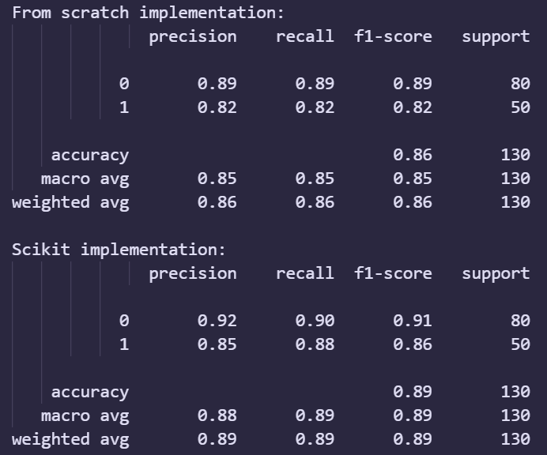

# At-Risk Flagging - Student Performance - Logistic Regression 

A fully from-scratch, vectorized implementation of Logistic Regression in Python, built to understand the mechanics behind one of the most fundamental algorithms in machine learning.

This project focuses on core math, gradient descent, vectorization, and evaluation.

It is trained on the [following dataset obtained from kaggle](https://www.kaggle.com/datasets/adilshamim8/personalized-learning-and-adaptive-education-dataset) to predict whether a student is at Risk or Not.

## Why This Project Exists

Every new Age Ed-Tech solution have some form of way to predict if a student is at risk or not. This project helped me to implement a similar solution.

Also...

The usual way for logistic regression is:

> from sklearn.linear_model import LogisticRegression

But this hides all the essential inner workings — the cost function, gradient updates, vectorization, numerical stability, feature scaling, and optimization.

This project helped me understand the fundamentals, not just how to import a library.

## What You Will Find Here

Pure NumPy-based implementation of Logistic Regression

Custom implementations of:

- Sigmoid function
- Binary cross-entropy cost function
- Gradient descent (vectorized)
- Prediction logic
- Accuracy, precision, recall, F1-score

- Direct benchmark vs Scikit-learn
- Analysis of performance gap

## Mathematical Foundations (Simplified)

1. Hypothesis Function

The model predicts:

$$
g(z) = \frac{1}{1 + e^{-z}}
$$

2. Cost Function (Binary Cross Entropy)

$$
J(\mathbf{w}, b) = -\frac{1}{m} \sum_{i=1}^{m} \left[ y^{(i)}\log(h_{\mathbf{w}}(\mathbf{x}^{(i)})) + (1-y^{(i)})\log(1 - h_{\mathbf{w}}(\mathbf{x}^{(i)})) \right]
$$

3. Gradient Descent Update Rule

$$
\frac{\partial J}{\partial w_j} = \frac{1}{m} \sum_{i=1}^{m} (h_{\mathbf{w}}(\mathbf{x}^{(i)}) - y^{(i)})x_j^{(i)}
$$
$$
\frac{\partial J}{\partial b} = \frac{1}{m} \sum_{i=1}^{m} (h_{\mathbf{w}}(\mathbf{x}^{(i)}) - y^{(i)})
$$

These equations are implemented using vectorized NumPy operations for speed and clarity.

## Project Structure
📁 student-performance-logistic-regression

│── main.py   # Model implementation

│── Student-Performance.ipynb          # Data analysis

│── README.md                # You are here

│── student-performance.csv                    # dataset

│── comparison.png                    # comparison

## Benchmark: From-Scratch vs Scikit-Learn

From-Scratch-Python model performs very closely to Scikit-learn, which:

Confirms the math + gradient descent are implemented correctly

### Analysis: Why Scikit-learn Performs Better

Scikit-learn uses:

- Advanced solvers (L-BFGS, liblinear, saga)
- C-optimized linear algebra
- Built-in regularization
- Automatic convergence heuristics

Here, the implemented model uses:

- Plain gradient descent
- No regularization
- Pure NumPy loops

The small gap in performance is due to these factors.

> This project taught me the basics of Vectorization, Cost functions & gradients, Optimization (gradient descent), ML evaluation metrics, Debugging and comparing models.
